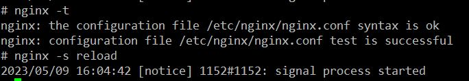

# Hosting Multiple applications with NGINX

Dockerfile - `Dockerfile`
```bash
docker build -t mynginxapp .
docker run -d -p 80:80 -p 443:443 --name mynginxapp-cont mynginxapp
```

```bash
docker cp nginx_files/codewithrams.com.conf mynginxapp-cont:/etc/nginx/conf.d/
docker cp nginx_files/app1.codewithrams.com.conf mynginxapp-cont:/etc/nginx/conf.d/
docker cp nginx_files/app2.codewithrams.com.conf mynginxapp-cont:/etc/nginx/conf.d/
docker cp nginx_files/jenkins.codewithrams.com.conf mynginxapp-cont:/etc/nginx/conf.d/
```

```bash
docker exec -it mynginxapp-cont /bin/sh
```
Inside the docker container run the below commands

```bash
apt-get install certbot python3-certbot-nginx -y
```

```bash
certbot certonly --agree-tos --email yourmail@email.com -d codewithrams.com
certbot certonly --agree-tos --email yourmail@email.com -d app1.codewithrams.com
certbot certonly --agree-tos --email yourmail@email.com -d app2.codewithrams.com
certbot certonly --agree-tos --email yourmail@email.com -d jenkins.codewithrams.com
```

```bash
nginx -t
nginx -s reload
```


[Code With Rams](https://codewithrams.com)
[App1](https://app1.codewithrams.com 
"App1-CodeWithRams")
[App2](https://app2.codewithrams.com 
"App2-CodeWithRams")
[Jenkins](https://jenkins.codewithrams.com 
"Jenkins-CodeWithRams")